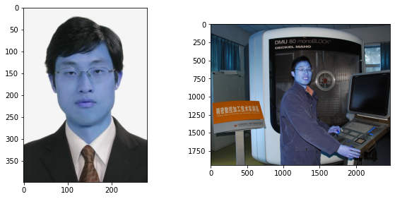
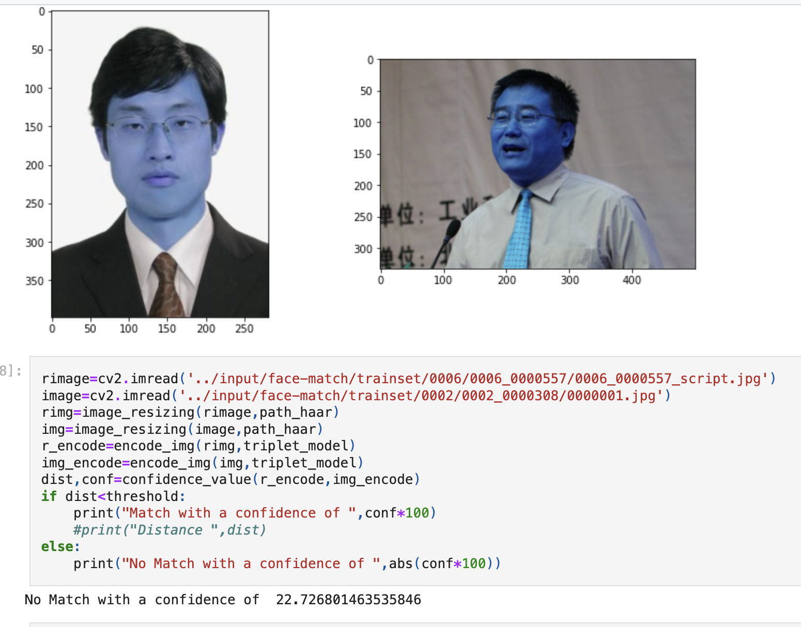

# Facial Verification (BioMetric) Using One-Shot Learning


## Introduction

Facial verification using biometric data has become an essential aspect of security systems, from mobile devices to advanced surveillance systems. Traditional methods often require a large amount of labeled data for training, which may not always be feasible. **One-Shot Learning** provides a solution by enabling facial verification with only a single training example. This project leverages One-Shot Learning techniques, particularly using Siamese Networks, to build an efficient and accurate facial verification system.

> **Learn more about One-Shot Learning**: [https://medium.com/@saba99/one-shot-learning-312e385993bc](https://medium.com/@saba99/one-shot-learning-312e385993bc)



## Testing Method

We use "Confidence" as a parameter, ideally you should set it to higher than 95%. But depends on how lenient you want to be!

The confidence_value function calculates how similar two facial encodings are by computing the distance between them. A smaller distance means the faces are more likely to match. It also provides a confidence score (between 0 and 1) that indicates the likelihood of a correct match, with a higher score suggesting a stronger match. This score helps decide if the two faces belong to the same person based on a set threshold.




## Installation

To run this project, you'll need to have Python 3.x installed along with the following dependencies:

```bash
pip install -r requirements.txt
